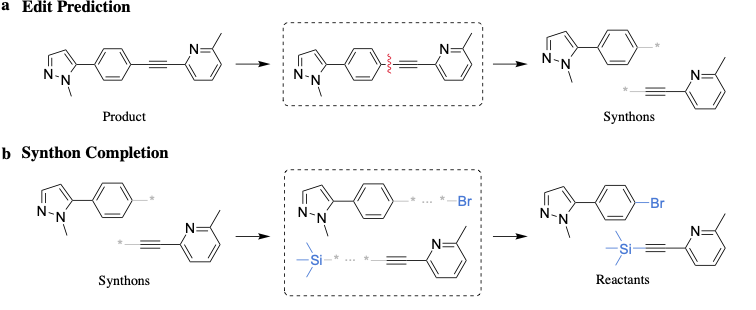

# Learning Graph Models for Retrosynthesis Prediction

(Under Construction and Subject to Change)

This is the official [PyTorch](https://pytorch.org/) implementation for _GraphRetro_ ([Somnath et al. 2021](https://openreview.net/pdf?id=SnONpXZ_uQ_)), a graph based model for one-step retrosynthesis prediction. Our model achieves the transformation from products to reactants using a two stage decomposition: 



a) __Edit Prediction__: Identifies edits given a product molecule, which upon application give intermediate molecules called _synthons_\
b) __Synthon Completion__: Completes _synthons_ into reactants by adding subgraphs called _leaving groups_ from a precomputed vocabulary. 

## Setup

This assumes conda is installed on your system \
If conda is not installed, download the [Miniconda installer](https://docs.conda.io/en/latest/miniconda.html#).
If conda is installed, run the following commands:

```
echo 'export SEQ_GRAPH_RETRO=/path/to/dir/' >> ~/.bashrc
source ~/.bashrc

conda env create -f environment.yml
source activate seq_gr
python setup.py develop(or install)
```

## Datasets
The original and canonicalized files are provided under `datasets/uspto-50k/`. Please make sure to move them to `$SEQ_GRAPH_RETRO/` before use.

## Input Preparation

Before preparing inputs, we canonicalize the products. This can be done by running,

```
python data_process/canonicalize_prod.py --filename train.csv
python data_process/canonicalize_prod.py --filename eval.csv
python data_process/canonicalize_prod.py --filename test.csv
```
This step can also be skipped if the canonicalized files are already present.
The preprocessing steps now directly work with the canonicalized files.

#### 1. Reaction Info preparation
```
python data_process/parse_info.py --mode train
python data_process/parse_info.py --mode eval
python data_process/parse_info.py --mode test
```

#### 2. Prepare batches for Edit Prediction
```
python data_process/core_edits/bond_edits.py
```

#### 3. Prepare batches for Synthon Completion
```
python data_process/lg_edits/lg_classifier.py
python data_process/lg_edits/lg_tensors.py
```

## Run a Model
Trained models are stored in `experiments/`. You can override this by adjusting `--exp_dir` before training.
Model configurations are stored in `config/MODEL_NAME` 
where `MODEL_NAME` is one of `{single_edit, lg_ind}`.

To run a model, 
```
python scripts/benchmarks/run_model.py --config_file configs/MODEL_NAME/defaults.yaml
```
NOTE: We recently updated the code to use wandb for experiment tracking. You would need to setup [wandb](https://docs.wandb.ai/quickstart) before being able to train a model.

## Evaluate using a Trained Model

To evaluate the trained model, run
```
python scripts/eval/single_edit_lg.py --edits_exp EDITS_EXP --edits_step EDITS_STEP \
                                      --lg_exp LG_EXP --lg_step LG_STEP
```
This will setup a model with the edit prediction module loaded from experiment `EDITS_EXP` and checkpoint `EDITS_STEP` \
and the synthon completion module loaded from experiment `LG_EXP` and checkpoint `LG_STEP`.

## Reproducing our results
To reproduce our results, please run the command,
```
./eval.sh
```
This will display the results for reaction class unknown and known setting.

## License
This project is licensed under the MIT-License. Please see [LICENSE.md](https://github.com/vsomnath/graphretro/blob/main/LICENSE.md) for more details.

## Reference
If you find our code useful for your work, please cite our paper:
```
@inproceedings{
somnath2021learning,
title={Learning Graph Models for Retrosynthesis Prediction},
author={Vignesh Ram Somnath and Charlotte Bunne and Connor W. Coley and Andreas Krause and Regina Barzilay},
booktitle={Thirty-Fifth Conference on Neural Information Processing Systems},
year={2021},
url={https://openreview.net/forum?id=SnONpXZ_uQ_}
}
```

## Contact
If you have any questions about the code, or want to report a bug, please raise a GitHub issue.

